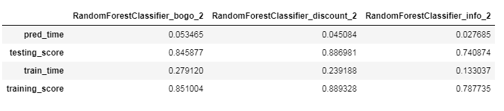
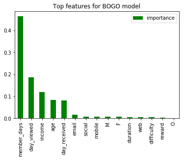
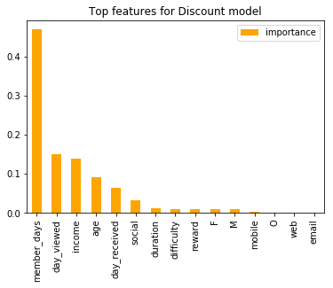
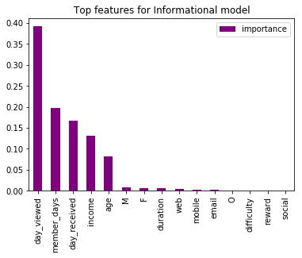

# Starbucks Capstone Challenge
### Project for the Udacity Data Science Nanodegree
<br>

## Introduction
Once every few days, Starbucks sends out an offer to users of the mobile app. An offer can be merely an advertisement for a drink 
or an actual offer such as a discount or BOGO (buy one get one free). Some users might not receive any offers during certain weeks. 

### Project motivation

The challenge with this data set is that not all users receive the same offer. 
There are different groups of customers that we need to take into account:
- Customers who viewed the offer and completed it within the time it was valid. These are the customers that 
have successfully responded to the offer and will be used
- Customers who viewed the offer but did not complete a purchase. 
- Customers who received the offer but didn't see it. We will not examine those.
- Customers who completed the offer without viewing it. 
From a business perspective, we don't want to include them as they are likely to proceed to purchase anyway

The question we would like to explore is: 

**Which groups respond best to which offer type and what are their demographic or other characteristics?** 

For each type of offer, we will build a model to predict if the customer will successfully respond to 
offer and what are the features with the highest importance.


## Dataset

The given data set contains simulated data that mimics customer behavior on the Starbucks rewards mobile app. 

This data set is a simplified version of the real Starbucks app because the underlying simulator only has one 
product whereas Starbucks actually sells dozens of products.

Note that informational offers have a validity period even though these ads are merely providing information about a product, so we assume the customer is feeling
the influence of the offer for only the specified duration after receiving the advertisement.

An exact description of the dataset is given in the notebook.

## Development
The analysis was conducted using Python 3.6.8. In order to run the notebook, the packages that need to be installed are :
`numpy`, `pandas`, `matplotlib`, `seaborn` and `sklearn` 


## Methodology


### 1. Exploratory Data Analysis

See distributions of variables, and how the dataframes look like.

### 2. Data Cleaning
Remove outliers, transoform columns, apply one-hot encoding.

### 3. Data Preprocessing

This was the tricky part of the project. 
The steps I folllowed were the following:

```
- Get person_id, customer_id of offers that were received and viewed.
- Get person_id, customer_id of offers that were viewed and completed.
- Merge those into offers
- Merge offers viewed with transactions into transactions completed
- Transform the time columns to days
- Split into groups based on conditions
- Repeat for transactions
- Create offer_responded column for succesful offers and tranactions
```
### 4. Build the models
The column we want to predict is the offer_responded . 
As features, I used the rest of the columns. For each dataset we used a 80/20 training/test split

I examined two models, a Decision Tree classifier, and the Random Forest Classifier. 
The Random Forest outperformed the Decision Tree in every type of offer.

The metrics used to evaluate their performance were: accuracy on the test set,
precision, recall, and f1-score.

Using Grid Search, we optimized the parameters for the best performing model which was the Random Foster Classifier.

### 5. Model Evaluation

Using the parameters found on from the Grid Search, we achieved a very good accuracy on the test set for every type of offer. 
Here are the scores for the best model for each offer:



The top features for each offer type were the following:

#### BOGO offer


#### Discount offer


#### Informational offer


## Conclusion

Overall, we gained some very interesting insights which features are more important in predicting if a customer will respond to an offer.

The data preprocessing was particularly challenging in this project. 
It is indeed true that data scientists spend 80% of their time cleaning data!

After cleaning the data, we identified two main groups of customers: those who have responded to an offer,
meaning that they have viewed it and performed a transaction while the offer was valid (in the duration from the day received) and
customers who did see the offer but did not eventually make a purchase. 

Then, the dataset was split by offer type (BOGO, discount, or informational) with the aim to explore separately what correlates with an offer being responded to each offer type.
For each offer two classifiers were trained ( Decision Tree and Random Forest) and fine-tuning the parameters of the best one with Grid Search, we achieved high accuracy on the test set for every type of offer. 
- BOGO: 0.85 test score
- Discount:0.89 test score
- Informational:0.74 test score

For all the BOGO and the discount offers, the most important features that affected if the offer will be responded to where the length of membership. The longer the customer as a member of Starbucks, the more likely they will respond to the offer they receive.
 The second most important feature was the day viewed. The day they viewed the offer was also the top feature of the informational offers, suggesting that certain days might be optimal for sending these types of offers. As far as the demographic characteristics, age and income played an important role as well.

### Publications

For a review of this analysis, you can [read my story on Medium](https://medium.com/@leedah/this-is-what-a-data-scientist-looks-like-aefa5c658d54?sk=c1ba5824f42da17e20609892ebfc6301).

## Future improvements
In future iterations, I would like to try more classifiers in order to achieve better scores. The results are promising but 
with more time, I think the model could be more fine-tuned.

In addition, it will be interesting to try to extract some more features from the data give,
like the total amount of offers a customer has received.

Finally, the cleaned dataset consisted of two groups: those who have responded to an offer and those who even 
though they viewed it, they didn't make a purchase. Other groups were also extracted,
for example, those who did buy the product regardless before viewing the offer, that could be taken consideration.
